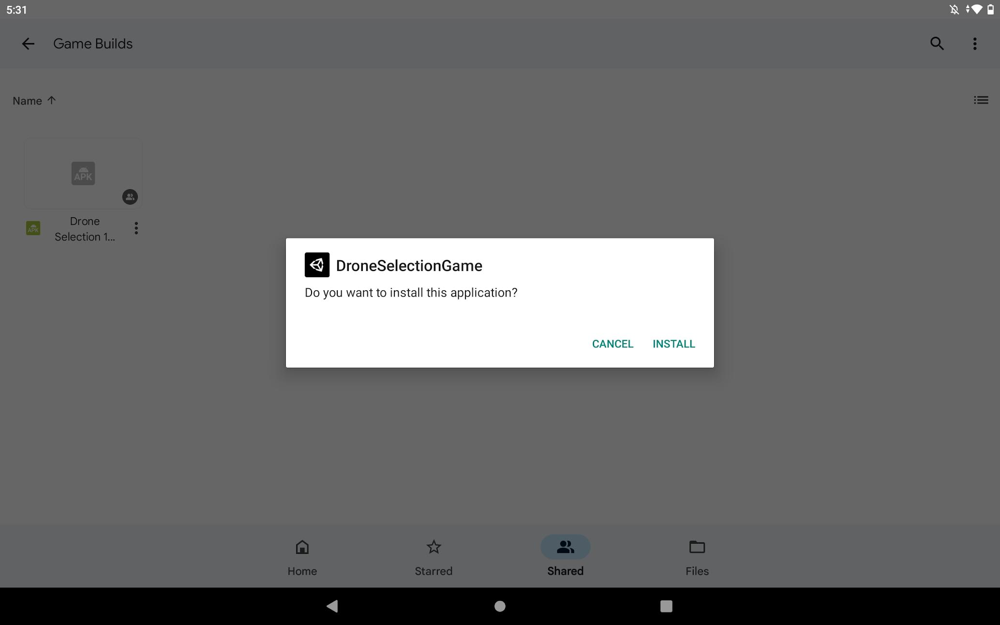
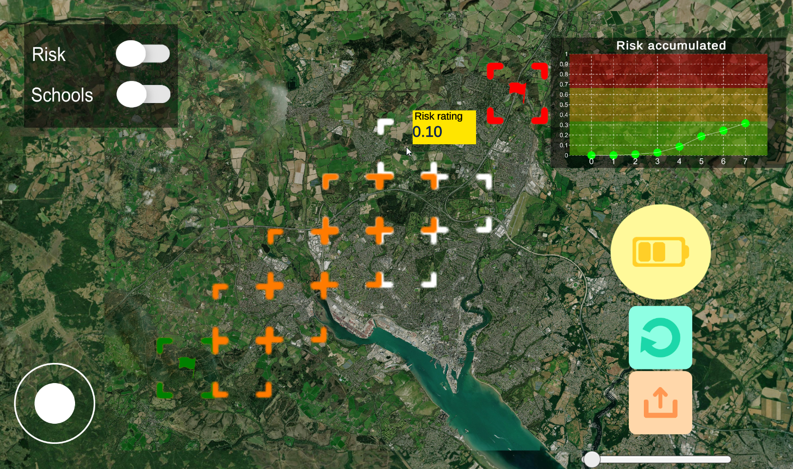
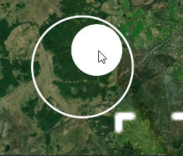
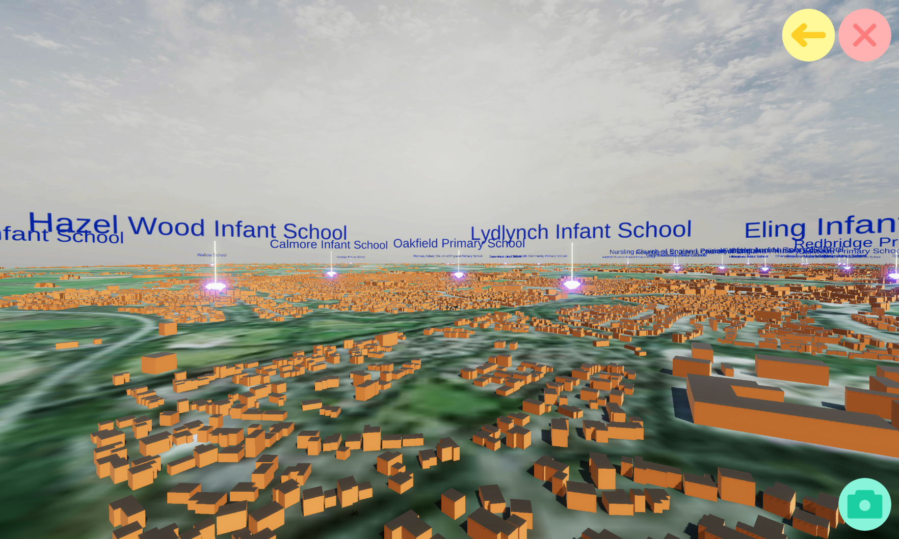

# DroneSelectionGame
E-Drone project path selection game

# How to install the game

Head over to the releases tab on the repository homepage [which can be seen here.](https://github.com/BenSnow6/DroneSelectionGame/releases)

Download the latest release .apk file to your tablet and save it somewhere you will remebmer.

Installing on the tablet can be done with the following steps:

1. Open the file explorer on the tablet and navigate to the location where you saved the .apk file.
2. Click on the .apk file and a pop up will appear asking if you want to install the app.

3. Click install and the app will be installed on the tablet.

4. Open the app when that is complete:

5. Enjoy the game!

The orange button is the submit route button, use this after you have selected a route that starts and ends on the flags to see the 3D flyover!

6. Controls for the game:

Zoom in and out with the scroll wheel.

Move around the map with the joystick on the left.

In the flyover scene you can return to the selection sequence with the yellow back button, close the game with the red X button, and toggle the camera view with the green camera button.
